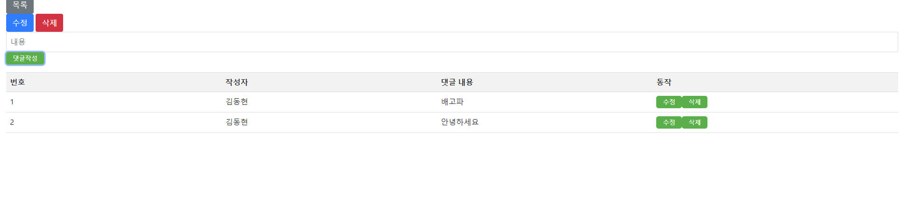

## 스프링부트 이용하여 게시판 만들기
---
## Board V1.5.0

### ※ 개발환경
\- __aplication.yml__  
\- __IDE : IDE : InteliJ IDEA Community__  
\- __Spring Boot 2.7.6__  
\- __JDK 11__  
\- __MySQL 8.0.35__  
\- __Lombok__
\- __Spring Web__  
\- __Spring Data JPA__  
\- __Thymleaf__

---

### ※ 게시판 주요기능(CURD)

1. __데이터 베이스__  
\- __A. 게시물 DB 저장__  
\- __B. 댓글 DB 저장__  

2. __게시물 기능__  
\- __A. 게시물 목록(/board)__  
\- __B. 게시물 등록(/board/save)__  
\- __C. 게시물 수정(/board/update/{id})__  
\- __D. 게시물 조회(/board/{id})__  
\- __E. 게시물 삭제(/board/delete/{id})__

3. __댓글 기능__  
\- __A. 댓글 작성(/comment/save)__  
\- __B. 댓글 삭제(/comment/delete/{id})__  
\- __C. 댓글 수정(/comment/update/{id})__

---

### ※ 수정 처리
1. __글삭제(/board/delete/{id})__  
2. __댓글 삭제(/comment/delete/{id})__  
2. __페이징 처리(/board/paging)__  
\- /board/paging?page=1  
\- /board/paging/1
3. __게시글__  
\- 한 페이지에  게시글 5개씩 ==> 최대 3개 페이지씩  
4. __파일 첨부하기__  
5. __단일 파일 첨부__  
6. __댓글 수정(/comment/update/{id})__

---

### ※ 향후 업데이트 예정 기능
1. __회원가입 및 로그인 기능__  
2. __게시글 검색 기능__  
3. __추천 버튼(추천 많이받을시 인기 게시물 등록)__

---

## ※ 기능 구현 설명 CURD

### 게시물
1. 메인화면(/) [localhost:8080](http://localhost:8080/)  

  

 

2. 게시판 페이지(/board, /board/paging)  
\-한 페이지 게시글 5개  
\-최대 3페이지씩

  

 

3. 게시물 작성(/board/save)  
  \- 파일첨부(단일/다중)

  

 

4. 게시물 조회(/board/{id})

  

 

5. 게시물 수정(/board/update/{id})  
\- 상세화면에서 수정 버튼 클릭  
\- 서버에서 해당 게시글 정보를 찾아서 가지고 수정 화면 출력

  

 

6. 게시물 수정 적용(/board/update)

  

 

7. 게시물 삭제(/board/delete/{id})  
\- 상세 화면에서 삭제 버튼 클릭하면 삭제가능

### 댓글
1. 게시물 댓글 작성(/comment/save)

  

 

2. 게시물 댓글 확인(/comment/getComments/{boardId})

  

 

3. 게시물 댓글 삭제(/comment/delete/{id})  
\- 게시물 화면에서 삭제버튼 클릭하면 삭제가능

4. 게시물 댓글 수정(/comment/update/{id})

  

 

  

 

### 파일 다운
1. 게시물에 첨부한 파일(이미지) 다운로드(/download/{uuid},{filename})

  

 

---

### ※ 버전 업데이트

### V1.0.0 (2023.11.21)

1. __[기능 기능 추가] 게시물 작성__  
\- 게시글 작성 버튼과 게시물 제목, 내용 입력 필드를 구현하였습니다. (엔드포인트: /board/save)
2. __[기능 기능 추가] 메인 페이지 이동__  
\- 메인 페이지로 이동하는 기능을 기능 추가하였습니다. (엔드포인트: /)

### V1.1.0 (2023.11.24)

1. __[기능 추가] 게시물 페이지__  
\- 게시물 페이지를 구현하였습니다. (엔드포인트: /board/paging)
2. __[기능 추가] 게시물 작성 화면 이동__  
\- 게시물 작성 화면으로 이동하는 기능을 추가하였습니다. (엔드포인트: /board/create)
3. __[기능 추가] 게시물 조회__  
\- 게시물 번호, 제목, 작성일, 내용을 조회하는 기능을 추가하였습니다. (엔드포인트: /board/{id})
4. __[기능 추가] 게시물 수정__  
\- 게시물을 수정하는 기능을 추가하였습니다. (엔드포인트: /board/update, /board/update/{id})
5. __[기능 추가] 게시물 삭제__  
\- 게시물을 삭제하는 기능을 추가하였습니다. (엔드포인트: /board/delete/{id})

### V1.2.0 (2023.11.25)
1. __[기능 추가] 게시물 댓글 연동__  
\- 게시물과 댓글을 연동하는 기능을 추가하였습니다. (엔드포인트: /getComments/{boardId})
2. __[기능 추가] 댓글 작성__  
\- 댓글 작성 버튼을 추가하였습니다. (엔드포인트: /comment/save)

### V1.3.0 (2023.11.26)

1. __[기능 추가] 댓글 삭제__
\- 댓글을 삭제하는 기능을 추가하였습니다. (엔드포인트: /comment/delete/{id})

### V1.4.0 (2023.11.28)

1. __[기능 추가] 게시물 파일 다운로드__  
\- 게시물 작성 시 파일을 다운로드할 수 있는 버튼을 추가하였습니다. (엔드포인트: /download/{uuid}/{fileName})

### V1.4.1 (2023.11.29)

1. __[보안 개선] 새로고침 후 목록 사라짐 방지__
2. __[보안 개선] 게시물 등록 시 파일 미등록 허용__
3. __[디자인 개선] 화면 디자인 수정__

### V1.5.0 (2023.12.12)
1. __[기능 추가] 댓글 카테고리 구현__
2. __[기능 추가] 댓글 수정__  
\- 댓글 수정 후에도 카테고리가 유지되도록 기능을 추가하였습니다. (엔드포인트: /comment/update/{id})
