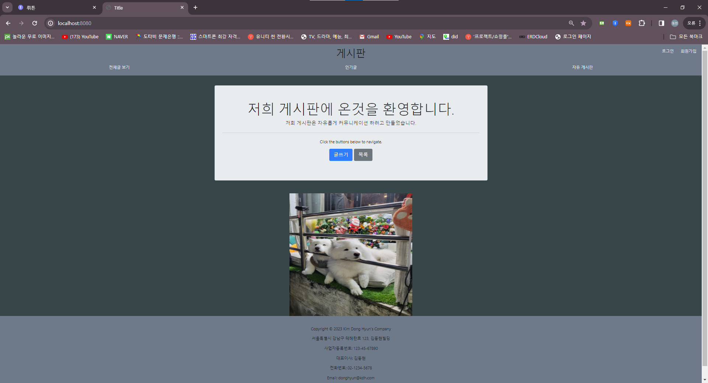
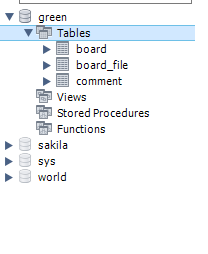
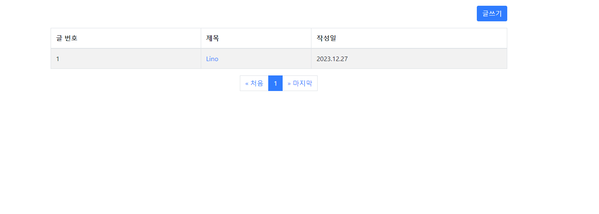
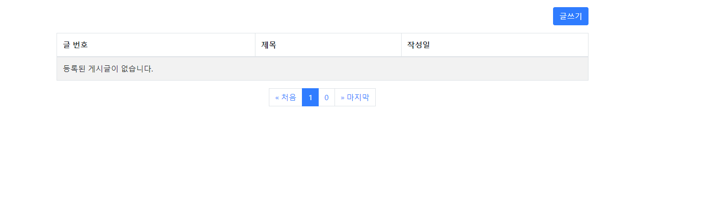

## 스프링부트 이용하 게시판 만들(11/20 ~ 12/1)

### ※ 개발환경
- __IDE : IDE : InteliJ IDEA Community__
- __Spring Boot 2.7.6__
- __JDK 11__
- __MySQL 8.0.35__
- __Spring Data JPA__
- __Thymleaf__

---

### ※ 게시판 주요기능(CURD)

#### 1. 데이터 베이스
1-1. __게시물 DB 저장__  
1-2. __댓글 DB 저장__  

#### 2. 게시물 기능
2-1. __게시물 등록__  
2-2. __게시물 수정__  
2-3. __게시물 조회__  
2-4. __게시물 삭제__

---
#### 3. 댓글 기능
3-1. __댓글 달기__  
3-2. __댓글 삭제__  

---

### ※ 수정 처리
1. __글삭제__  
2. __페이징 처리__  
3. __게시글__  
- __페이지 당 5페이지 ==>3개__  
4. __파일 첨부하기__  
5. __단일 파일 첨부__  
6. __다중 파일 첨부__  

---

### ※ 향후 업데이트 예정 기능
1. __추천 버튼(추천 많이받을시 인기 게시물 등록)__  
2. __게시글 검색 기능__  
3. __댓글 수정 기능__  

---

### ※ 버전 업데이트

- __1.0.00 : 게시물 CRUD 구현 - 주요 기능 구현으로 주 버전 업데이트(11/20~11/22)__
- __1.0.05 : 댓글 기능 구현 - 부분적 기능 추가로 부 버전 업데이트(11/23~11/24)__
- __1.0.10 : 게시물 파일 첨부 기능 추가 - 부분적 기능 추가로 부 버전 업데이트(11/24)__
- __1.0.15 : 댓글 작성시 게시물과 연동 과정 구현 - 부분적 기능 추가로 부 버전 업데이트(11/25)__
- __1.0.20 : html, css View 화면 업데이트 - 부분적 기능 추가로 부 버전 업데이트(11/26~11/27)__
- __1.0.25 : 댓글 Delete 기능 추가 - 소소한 변동사항으로 패치 버전 업데이트(11/28)__

---

### ※ 기능 구현 설명 CURD

#### __1.InteliJ 실행후 [localhost:8080](http://localhost:8080/) 으로 들어가서 글쓰기를 누릅니다.__

  

 

##### MySQL

  

 

#### __2. Title,Contents작성후 File까지 첨부하고(File 첨부는 null값이여도 상관없습니다.)__

  

 

- __게시물 작성후 데이터 베이스에 Board,File 정보가 저장된것을 확인할수 있습니다.__

##### MySQL(Board)

  

 

##### MySQL(File)

  

 

#### __3.그러면 자동으 게시판으로 이동후 게시판 으로 들어가면__

  

 

#### __4.게시판 내부 뷰__

  

 

#### __5.게시판 목록 기능__
- __게시판 목록버튼을 클릭하면 게시판으로 이동합니다.__

  

 

#### __6.게시판 수정기능__

  

 

- __수정버튼을 누른후 적용 되어있는걸 확인할수 있습니다.__

  

 

##### MySQL

- __SQL에도 잘저장 되어있는것을 확인할수 있습니다.__

  

 

#### __7. 게시판 파일 다운로드__
- __파일 다운로드를 누르면 제가등록한 파일이 다운로드 되는것을 확인할수 있습니다.__

  

 

#### __8.게시판 삭제기능__

- __삭제버튼을 누르면 게시판으로 넘어가면서 삭제된걸 확인할수 있습니다.__

  

 

##### MySQL(Board)

- __뷰에서 삭제버튼을 누른후 SQL에도 File,Board가 삭제된것을 확인할수있습니다.__

  

 

##### MySQL(File)

  

 

#### __9.게시판 댓글기능__
- __댓글 작성자와 내용을 입력후 댓글작성 버튼을 누르면 현재화면처럼 댓글이 등록되어있는것을 확인할수 있습니다.__

  

 

##### MySQL

- __댓글 작성한것이 SQL에 잘 저장되어있는것을 확인할수 있습니다.__

  

 

#### __10.게시판 댓글삭제__
- __댓글 작성이 되어있고 그 댓글을 삭제버튼을 누를시 즉시 삭제됩니다.__

  

 

##### MySQL

- __댓글 삭제후 SQL에도 사라진것을 확인할수 있습니다.__

  

 
