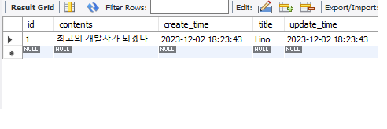

## 스프링부트 이용하여 게시판 만들기
---
## Board V1.4.1(11/20 ~ 12/1)

### ※ 개발환경
\- __aplication.yml__  
\- __IDE : IDE : InteliJ IDEA Community__  
\- __Spring Boot 2.7.6__  
\- __JDK 11__  
\- __MySQL 8.0.35__  
\- __Lombok__  
\- __Spring Web__  
\- __Spring Data JPA__  
\- __Thymleaf__

---

### ※ 게시판 주요기능(CURD)

1. __데이터 베이스__
\- __A. 게시물 DB 저장__  
\- __B. 댓글 DB 저장__

2. __게시물 기능__
\- __A. 게시물 목록(/board)__  
\- __B. 게시물 등록(/board/save)__  
\- __C. 게시물 수정(/board/update/{id})__  
\- __D. 게시물 조회(/board/{id})__  
\- __E. 게시물 삭제(/board/delete/{id})__  

3. __댓글 기능__
\- __A. 댓글 작성(/comment/save)__  
\- __B. 댓글 삭제(/comment/delete/{id})__

---

### ※ 수정 처리
1. __글삭제(/board/delete/{id})__  
2. __댓글 삭제(/comment/delete/{id})__  
2. __페이징 처리(/board/paging)__  
\- /board/paging?page=1  
\- /board/paging/1
3. __게시글__  
\- 한 페이지에  게시글 5개씩 ==> 최대 3개 페이지씩  
\- 한페이지에  3개씩 ==>5개

4. __파일 첨부하기__
5. __단일 파일 첨부__
6. __다중 파일 첨부__

---

### ※ 향후 업데이트 예정 기능
1. __추천 버튼(추천 많이받을시 인기 게시물 등록)__
2. __게시글 검색 기능__
3. __댓글 수정 기능__
4. __회원가입 및 로그인 기능__

---

### ※ 버전 업데이트

### V1.0.0 (2023.11.21)

1. __[추가] 게시물 작성 구현(/board/save)__  
\- 게시글 작성 버튼 구현(Html)  
\- 게시글 작성 구현 게시물 제목,게시물 내용(Html)
2. __[추가] 메인 페이지 이동 구현(/)__

### V1.1.0 (2023.11.24)

1. __[추가] 게시물 페이지 구현(/board/paging)__
2. __[추가] 게시물 작성 화면으로 이동(/board/create)__
3. __[추가] 게시물 조회(/board/{id})__  
\- 게시물 번호, 게시물 제목,게시글 작성일, 게시글 내용  
\- 목록,수정,삭제 버튼(Html, JavaScript)
4. __[추가] 게시물 수정(/board/update,/board/update/{id})__
5. __[추가] 게시물 삭제(/board/delete/{id})__

### V1.2.0 (2023.11.25)
1. __[추가] 게시물 게시글 연동(/getComments/{boardId})__
2. __[추가] 게시글 작성(/comment/save)__  
\- 게시글 버튼 작성(Html, JavaScript)

### V1.3.0 (2023.11.26)

1. __[추가] 게시글 삭제(/comment/delete/{id})__  
\- 게시글 삭제 버튼(Html, JavaScript)

### V1.4.0 (2023.11.28)

1. __[추가] 게시물 파일 다운로드(/download/{uuid}/{fileName})__  
\- 게시글 작성시 다운로드 버튼(Html, JavaScript)
### V1.4.1 (2023.11.28)

1. __새로고침후 목록 사라지는거 보안__
2. __게시물 등록시 파일을 등록을 안하여도 등록되도록 보안__
3. __화면 디자 수정__

---

### ※ 기능 구현 설명 (My SQL)

##### MySQL(Table)

  

 

##### MySQL(Board)

  

 

##### MySQL(File)

  

 

##### MySQL

- __SQL에도 잘 저장 되어있는것을 확인할수 있습니다.__

  

 

##### MySQL(Board)

- __뷰에서 삭제버튼을 누른후 SQL에도 File,Board가 삭제된것을 확인할수있습니다.__

  

 

##### MySQL(File)

  

 

##### MySQL

- __댓글 작성한것이 SQL에 잘 저장되어있는것을 확인할수 있습니다.__

  

 

##### MySQL

- __댓글 삭제후 SQL에도 사라진것을 확인할수 있습니다.__

  

 
